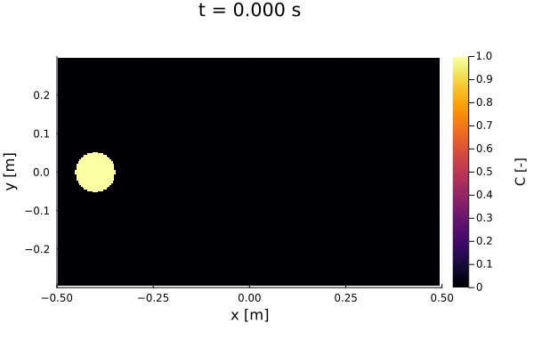
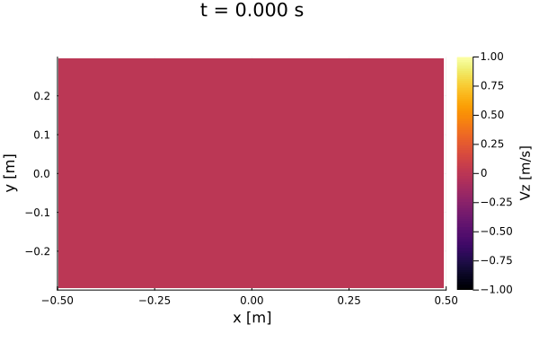

# NavierStokes3D

1. [Introduction](#introduction)
2. [Mathematical model](#mathematical-model)
3. [Numerical model](#numerical-model)
4. [Test case](#test-case)
4. [Known bugs](#known-bugs)

## Introduction
NavierStokes3D is a solver for the incompressible 3D Navier Stokes equations. The code can be run both on multi-core CPUs or and GPUs enabled by making use of the [ParallelStencil.jl](https://github.com/omlins/ParallelStencil.jl) library, or even on multiple GPUs by making use of [ImplicitGlobalGrid.jl](https://github.com/eth-cscs/ImplicitGlobalGrid.jl). For time reasons und due encountered instabilities, the current version does not feature a turbulence model. An integration of a turbulence model to solve the Reynolds-Averaged Navier Stokes (RANS) equations, as well as a interface-tracking method such as Level-Set may be integrated at a later point. The development of this code was inspired by [NavierStokes.jl](https://github.com/utkinis/NavierStokes.jl) and therefore may exhibit similarities or common code parts. The main contribution of this repository is the extension to 3D and to a multi-GPU code.

The code can be run with:

```bash
julia -O3 --check-bounds=no scripts/NavierStokes3D.jl
```

## Mathematical model
The incompressible 3D Navier Stokes equations are defined as

$$\frac{\partial \boldsymbol{u}}{\partial t} + \left(\boldsymbol{u} \cdot \nabla \right)\boldsymbol{u} = -\frac{1}{\rho}\nabla p + \nu \nabla^2 \boldsymbol{u} + \boldsymbol{f} $$

where $\boldsymbol{u}$ is the velocity vector field, $p$ the pressure field, $\boldsymbol{f}$ are body forces, $\rho$ the density and $\nu$ the dynamic viscosity.

Further, the continuity equation for incompressible flow can be written as:

$$\nabla \cdot \boldsymbol{u} = 0$$

## Numerical model
One of the difficulties when solving the Navier Stokes equations with a first order finite difference and explicit Euler scheme for time, is the dependency on the pressure gradient at the new time step $\boldsymbol{u}^{n+1}$ on $\nabla p^{n+1}$ and also fullfilling the continuity contraint $\nabla\cdot\boldsymbol{u}^{n+1}=0$.

$$\frac{\boldsymbol{u}^{n+1} - \boldsymbol{u}^{n}}{\Delta t} + \left(\boldsymbol{u}^{n} \cdot \nabla \right)\boldsymbol{u}^{n} = -\frac{1}{\rho}\nabla p^{n+1} + \nu \nabla^2 \boldsymbol{u}^{n} + \boldsymbol{f}^{n}$$

To overcome this difficulty, the splitting scheme of Chorin, also called Chorin's method, was applied. Therefore, an intermediate velocity $\boldsymbol{u}^{*}$ is computed in a first step by only considering the diffusive term and the body force $\boldsymbol{g}$:

$$\boldsymbol{u}^{*} = \boldsymbol{u}^{n} +  \Delta t(\nu \nabla^2 \boldsymbol{u}^{n} + \boldsymbol{g}^{n})$$

In a second step, the velocity a second intermediate time step $\boldsymbol{u}^{**}$ can be defined as by only considering the pressure term as:

$$\frac{\boldsymbol{u}^{**} - \boldsymbol{u}^{n}}{\Delta t} = -\frac{1}{\rho}\nabla p^{n+1}$$

By taking the divergence  $\nabla\cdot$ of the above equation and requiring that $\nabla\cdot\boldsymbol{u}^{**}=0$, one obtains the Poisson equation:

$$\nabla^2p^{n+1} = \frac{\rho}{\Delta t} \nabla \cdot\boldsymbol{u}^{*}$$

The Poisson equation is solved by applying a pseudo-transient method. The pseudo-transient equation is solved iteratively.

$$\frac{\partial p}{\partial \tau} + \Delta^2p^n = \frac{\rho}{\Delta t} \nabla \cdot\boldsymbol{u}^{*}$$

In a final step, the velocity at the new time step is obtained with an advection step solved with the method of characteristics:

$$\frac{\boldsymbol{u}^{n+1} - \boldsymbol{u}^{**} }{\Delta t} = - \left(\boldsymbol{u}^{**} \cdot \nabla \right)\boldsymbol{u}^{**}$$


## Test case
The solver was applied for solving a test case consisting of flow around a cylinder on a grid of 255x153x153 grid cells.

The tracer concentration, the streamwise, transversal and vertical velocity fields as well as the pressure field in the x-y-plane at z = 0.5*lz are visualized in Figures 1 to 5.

  
*Figure 1: Tracer transport with by flow around a cylinder.*

  
*Figure 2: Velocity field $Vx$ of the flow around a cylinder.*

  
*Figure 3: Velocity field $Vy$ of the flow around a cylinder.*

  
*Figure 4: Velocity field $Vz$ of the flow around a cylinder.*

  
*Figure 5: Velocity field $p$ of the flow around a cylinder.*

The tracer concentration, the streamwise, transversal and vertical velocity fields as well as the pressure field in the x-y-plane at y = 0.5*ly are visualized in Figures 6 to 10.

  
*Figure 6: Tracer transport with by flow around a cylinder.*

  
*Figure 7: Velocity field $Vx$ of the flow around a cylinder.*

  
*Figure 8: Velocity field $Vy$ of the flow around a cylinder.*

  
*Figure 9: Velocity field $Vz$ of the flow around a cylinder.*

  
*Figure 10: Velocity field $p$ of the flow around a cylinder.*

## Known bugs:
 - Outflow boundary condition becomes unstable at one point
 - Automated docu generation fails due to inline function backtrack!(..)
 - CI fails
